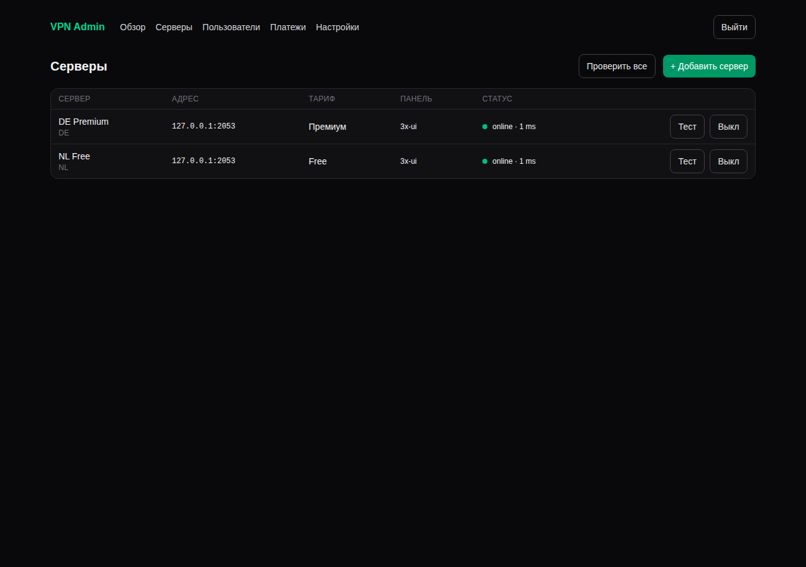

# VPN Platform

Платформа для VPN-сервиса на VLESS + Reality:

- **`apps/dashboard`**: админ-дашборд и API для iOS-приложения (Next.js, Postgres, Drizzle).
- **`apps/ios`**: iOS-приложение (SwiftUI, Packet Tunnel и Xray-core через libXray, AdMob, RevenueCat или StoreKit 2). Сборка описана в [apps/ios/README.md](apps/ios/README.md).
- **`infra/node/install.sh`**: установка VPN-ноды одной командой. Скрипт ставит 3x-ui и Xray, создаёт VLESS + Reality и регистрирует ноду в дашборде. Подробнее в [docs/node-setup.md](docs/node-setup.md).



## Как это работает

```
iPhone app ──HTTPS──► dashboard API ──API панели──► VPN-нода (Xray, 3x-ui / Marzban)
     │                      ▲
     └── VLESS+Reality ─────┼──────────────────────► VPN-нода
                            │
     RevenueCat / App Store / AdMob ── вебхуки ──────┘
```

1. При первом запуске приложение генерирует `installId` (UUID в Keychain) и вызывает `POST /api/v1/devices/register`. В ответ приходит токен.
2. `GET /api/v1/config` сообщает приложению, какой биллинг использовать (RevenueCat или StoreKit; переключается в дашборде) и какие рекламные блоки показывать.
3. Бесплатный пользователь смотрит rewarded-рекламу. AdMob вызывает `/api/v1/ads/admob-ssv` (подпись проверяется), и устройству начисляется N минут.
4. Премиум приходит из вебхука RevenueCat или App Store Server Notifications, либо приложение само отправляет транзакцию StoreKit 2.
5. `POST /api/v1/connect` проверяет доступ, создаёт на ноде **личного** VLESS-клиента устройства со сроком действия, равным оплаченному или «рекламному» времени, и возвращает готовый конфиг Xray для приложения.
6. Если у ноды есть IPv6, каждое устройство получает **свой IPv6-адрес** из её подсети. Заблокированный адрес приложение меняет на новый через `rotateIpv6`.
7. Когда время заканчивается (или при возврате денег и бане), нода сама отключает клиента. Даже сохранённый конфиг перестаёт работать.

## Быстрый старт (локально)

```bash
bun install
cp apps/dashboard/.env.example apps/dashboard/.env.local   # заполните значения
cd apps/dashboard
bunx drizzle-kit migrate
bun run dev        # http://localhost:3000, вход по ADMIN_EMAIL / ADMIN_PASSWORD
bun test           # тесты проверки подписей Apple JWS и AdMob SSV
```

## Деплой (VPS + Docker)

```bash
cp apps/dashboard/.env.example apps/dashboard/.env      # заполните
POSTGRES_PASSWORD=... docker compose up -d --build
```

Поднимутся Postgres, миграции, дашборд на `:3000` и cron, который раз в минуту проверяет ноды.
Перед дашбордом поставьте HTTPS-прокси (Caddy или nginx): вебхуки Apple и RevenueCat работают только по HTTPS.

## Добавление серверов

Задайте `NODE_REGISTRATION_TOKEN` в `.env` дашборда, затем на чистом VPS выполните команду со страницы **Серверы**:

```bash
curl -fsSL https://<дашборд>/install.sh | sudo bash -s -- \
  --dashboard https://<дашборд> --token <NODE_REGISTRATION_TOKEN> --country NL
```

## Настройка в дашборде

**Настройки → Провайдер подписок.** Переключатель RevenueCat / StoreKit 2. Вебхуки обоих провайдеров принимаются всегда, так что уже оформленные подписки не теряются при переключении.

| Что | Куда вписать |
| --- | --- |
| RevenueCat → Integrations → Webhooks | URL `https://<домен>/api/webhooks/revenuecat`, Authorization: то же значение, что в дашборде |
| RevenueCat → API keys | Public iOS key (`appl_…`) и Secret key (`sk_…`) |
| App Store Connect → App → App Store Server Notifications (V2) | `https://<домен>/api/webhooks/appstore` |
| AdMob → Rewarded ad unit → Server-side verification | `https://<домен>/api/v1/ads/admob-ssv` |

## API для приложения

Все запросы, кроме `register` и `config`, требуют заголовок `Authorization: Bearer <token>`.

| Метод | Путь | Описание |
| --- | --- | --- |
| POST | `/api/v1/devices/register` | `{installId, appVersion}` → `{token}` |
| GET | `/api/v1/config` | биллинг-провайдер, ключи SDK, рекламные блоки |
| GET | `/api/v1/me` | `{premium, premiumUntil, freeUntil, needsAd}` |
| GET | `/api/v1/servers` | список серверов, у каждого флаг `locked` |
| POST | `/api/v1/connect` | `{serverId, ipv6?, rotateIpv6?}` → `{expiresAt, addresses, ipv6Address, vlessUri, xray}`; ошибки `ad_required`, `premium_required`, `banned`, `ipv6_required` |
| POST | `/api/v1/subscription/refresh` | перечитать подписку в RevenueCat сразу после покупки |
| POST | `/api/v1/subscription/storekit` | `{signedTransaction}` (StoreKit 2 `jwsRepresentation`) |
